# Event Flow Documentation

This document traces how events flow across processes, services, workflows, and UI components in the ARchitect application. Use these diagrams to understand the wiring before making changes.

## Table of Contents

- [Architecture Overview](#architecture-overview)
- [Module Responsibilities](#module-responsibilities)
- [Process Boundary (IPC)](#process-boundary-ipc)
- [Agent Stream Pattern](#agent-stream-pattern)
- [Chat Message Flow](#chat-message-flow)
- [Streaming & Card Rendering](#streaming--card-rendering)
- [Card Action Dispatch](#card-action-dispatch)
- [New Policy Creation](#new-policy-creation)
- [Open Existing Policy](#open-existing-policy)
- [Progressive Section Import](#progressive-section-import)
- [Build Workflow Monitoring](#build-workflow-monitoring)
- [Fidelity Report Flow](#fidelity-report-flow)
- [Test Panel Interactions](#test-panel-interactions)
- [Test Chat Session Lifecycle](#test-chat-session-lifecycle)
- [Document Preview Interactions](#document-preview-interactions)
- [Policy Update Detection](#policy-update-detection)
- [MCP Server Subprocess](#mcp-server-subprocess)
- [Callback Wiring Summary](#callback-wiring-summary)
- [Debug Logging & Export](#debug-logging--export)

---

## Architecture Overview

The application uses a hybrid architecture: `renderer.ts` is the composition root
for service instantiation and event wiring, while `App.tsx` is the React root
component managing screens and modals. Two imperative bridge handles
(`window.__appHandle` and `window.__workspaceLayout`) allow the legacy composition
root to drive React state during the ongoing Cloudscape migration.

> **Migration note:** The `__appHandle` and `__workspaceLayout` bridges are
> temporary artifacts. Remove them when all workflows use React state/routing
> directly. Call sites that depend on `__appHandle`: `handleCreatePolicy`,
> `handleOpenPolicy`, `handlePolicySelected`, `showScreen`, and the
> `SectionImportDialog` bridge.

```
Main Process (Node.js)          Preload Bridge          Renderer Process (Browser)
┌─────────────────────┐    ┌──────────────────┐    ┌──────────────────────────────────────┐
│ main.ts             │    │ preload.ts        │    │ App.tsx (React Root)                 │
│ AcpClient           │◄──►│ window.architect  │◄──►│   ├── LandingScreen                  │
│ File System         │    │ API               │    │   ├── BuildingScreen                  │
│ Kiro CLI subprocess │    └──────────────────┘    │   ├── WorkspaceLayout                 │
│                     │                            │   │   ├── DocumentPreviewPanel         │
│ MCP Server          │                            │   │   ├── TestPanel                    │
│ (separate process)  │                            │   │   └── ChatPanelComponent           │
│ mcp-server-entry.ts │                            │   ├── PolicyPickerModal                │
│ PolicyWorkflowSvc   │                            │   ├── NewPolicyModal                   │
└─────────────────────┘                            │   └── SectionImportModal               │
                                                   │                                        │
                                                   │ renderer.ts (Composition Root)         │
                                                   │   ├── ChatSessionManager               │
                                                   │   ├── BuildOrchestrator                │
                                                   │   ├── PolicyService                    │
                                                   │   │                                    │
                                                   │   ├── Workflows                        │
                                                   │   │   ├── policy-loader.ts             │
                                                   │   │   ├── test-workflows.ts            │
                                                   │   │   ├── section-import.ts            │
                                                   │   │   ├── chat-message.ts              │
                                                   │   │   ├── section-wiring.ts            │
                                                   │   │   └── card-actions.ts              │
                                                   │   │                                    │
                                                   │   ├── Services                         │
                                                   │   │   ├── chat-service.ts              │
                                                   │   │   ├── chat-context-router.ts       │
                                                   │   │   ├── context-index.ts             │
                                                   │   │   ├── fidelity-workflow.ts         │
                                                   │   │   └── build-assets-store.ts        │
                                                   │   │                                    │
                                                   │   ├── State                            │
                                                   │   │   └── policy-state.ts              │
                                                   │   │                                    │
                                                   │   ├── Contexts                         │
                                                   │   │   └── ServiceContext.tsx            │
                                                   │   │                                    │
                                                   │   └── Utils                            │
                                                   │       ├── agent-stream.ts              │
                                                   │       └── stream-parser.ts             │
                                                   └──────────────────────────────────────┘
```

---

## Module Responsibilities

| Module | Location | Responsibility |
|--------|----------|----------------|
| `renderer.ts` | Composition root | Service/component instantiation, event wiring, `handleNewPolicy`, `handleOpenPolicy`, `onSendMessage` handler |
| `App.tsx` | React root | Screen router (`landing \| building \| workspace`), modal host, imperative `AppHandle` bridge to `renderer.ts` |
| `WorkspaceLayout.tsx` | `src/components/` | Three-panel workspace layout (doc preview, test panel, chat), exposes `__workspaceLayout` toggle handle |
| `ServiceContext.tsx` | `src/contexts/` | React context provider for `{ policyService, buildOrchestrator, chatSessionMgr }` |
| `policy-state.ts` | `src/state/` | Centralized app state (8 state variables including `contextIndex`), persistence helpers, derived state accessors, compact context builder (`buildPolicyContext` with optional `targetTest` parameter) |
| `BuildOrchestrator` | `src/services/` | Build asset loading, fidelity report management, background polling |
| `ChatSessionManager` | `src/services/` | Chat session lifecycle, MCP config, session caching, history persistence, test chat sessions |
| `section-import.ts` | `src/workflows/` | Progressive document import orchestration (`importSection`, `importMultipleSections`, `executeSectionImport`) |
| `chat-message.ts` | `src/workflows/` | Chat message send handler (`createSendMessageHandler`), uses `installStreamHandler` for streaming |
| `section-wiring.ts` | `src/workflows/` | Section import callback wiring for DocumentPreview (`wireSectionHandlers`) |
| `PolicyService` | `src/services/` | Bedrock SDK wrapper (CRUD, builds, tests, scenarios, build slot management) |
| `PolicyWorkflowService` | `src/services/` | Deterministic policy workflows (REFINE_POLICY, test execution via MCP tools) |
| `ChatService` | `src/services/` | Kiro CLI ACP integration (chat, summarization, card extraction) |
| `policy-loader.ts` | `src/workflows/` | `loadPolicy` orchestration (definition export, metadata, progressive import recovery, build assets, agent greeting) |
| `test-workflows.ts` | `src/workflows/` | Test panel event handlers, `refreshTestsAfterPolicyChange`, test analysis prompts, highlight filter computation |
| `card-actions.ts` | `src/workflows/` | Card action dispatch (`createCardActionHandler`) |
| `agent-stream.ts` | `src/utils/` | Shared streaming utility: `installStreamHandler` (save/set/restore pattern) and `streamAgentMessage` (fire-and-forget). Used across 4 call sites |
| `useStreamProcessor.ts` | `src/hooks/` | React hook for incremental chat stream processing, card boundary detection, stable segment keys |
| `useCliErrors.ts` | `src/hooks/` | React hook for CLI error notifications via `acp:cli-error` IPC channel |
| `approval-code-store.ts` | `src/services/` | Shared Node.js module for approval code write/consume. Used by main process (write via IPC) and MCP server subprocess (consume during tool dispatch) |
| `mcp-server-entry.ts` | `src/` | Standalone MCP server entry point (stdio JSON-RPC). Spawned by Kiro CLI, owns its own `PolicyService` + `PolicyWorkflowService` instances |
| `mcp-request-handler.ts` | `src/services/` | MCP JSON-RPC request routing (`initialize`, `tools/list`, `tools/call`) |
| `policy-mcp-server.ts` | `src/services/` | MCP tool definitions (`POLICY_TOOLS` + `SEARCH_TOOLS`) and `dispatchToolCall` — dispatches to `PolicyWorkflowService` methods and context index search functions |
| `context-index.ts` | `src/services/` | In-memory context index over policy data. Holds definition, document, fidelity report, and derived lookup maps. Provides search functions (`searchDocument`, `searchRules`, `searchVariables`, `getSectionRules`, `getRuleDetails`, `getVariableDetails`, `findRelatedContent`), compact context builder (`buildPolicyOutline`, `buildTaskContext`), and serialization for MCP subprocess IPC |
| `chat-context-router.ts` | `src/services/` | Per-context chat state multiplexer. Maintains separate segment arrays and stream state per chat context (policy vs test), preventing message leakage during context switches. Used by `ChatPanelComponent` |
| `fidelity-workflow.ts` | `src/services/` | Shared fidelity report build workflow (`runFidelityBuildWorkflow`). Encapsulates ensure-slot → start-build → poll → fetch-asset → parse. Used by both `BuildOrchestrator` (UI-facing) and `PolicyWorkflowService` (MCP-facing) |
| `stream-parser.ts` | `src/utils/` | Pure function for detecting card boundaries in raw streamed text. Extracted from `useStreamProcessor` so it can be shared by `ChatContextRouter` |
| `debug-logger.ts` | `src/services/` | Structured JSON-lines logger for the main process. Writes to `~/.ARchitect/logs/debug.jsonl` with automatic rotation. Taps existing ACP event streams |
| `debug-snapshot.ts` | `src/utils/` | Builds a sanitized state snapshot for the debug export. Renderer-side only, reads from `policy-state.ts` getters |

### Dependency Injection Pattern

Orchestrator services and workflows accept UI dependencies through callback interfaces, not direct component imports. This keeps them testable:

- `BuildOrchestrator` receives `BuildOrchestratorUI` + `BuildOrchestratorState`
- `ChatSessionManager` receives `ChatSessionUI` + `ChatSessionState`
- `wireTestPanelHandlers` receives `TestWorkflowDeps`
- `loadPolicy` receives `PolicyLoaderDeps`
- `importSection` / `importMultipleSections` receive `SectionImportDeps`
- `createCardActionHandler` receives `CardActionDeps`
- `createSendMessageHandler` receives `ChatMessageDeps`

All dependency bags are constructed in `renderer.ts` (the composition root).

---

## Process Boundary (IPC)

All communication between main and renderer goes through the preload bridge. The renderer never accesses Node.js APIs directly.

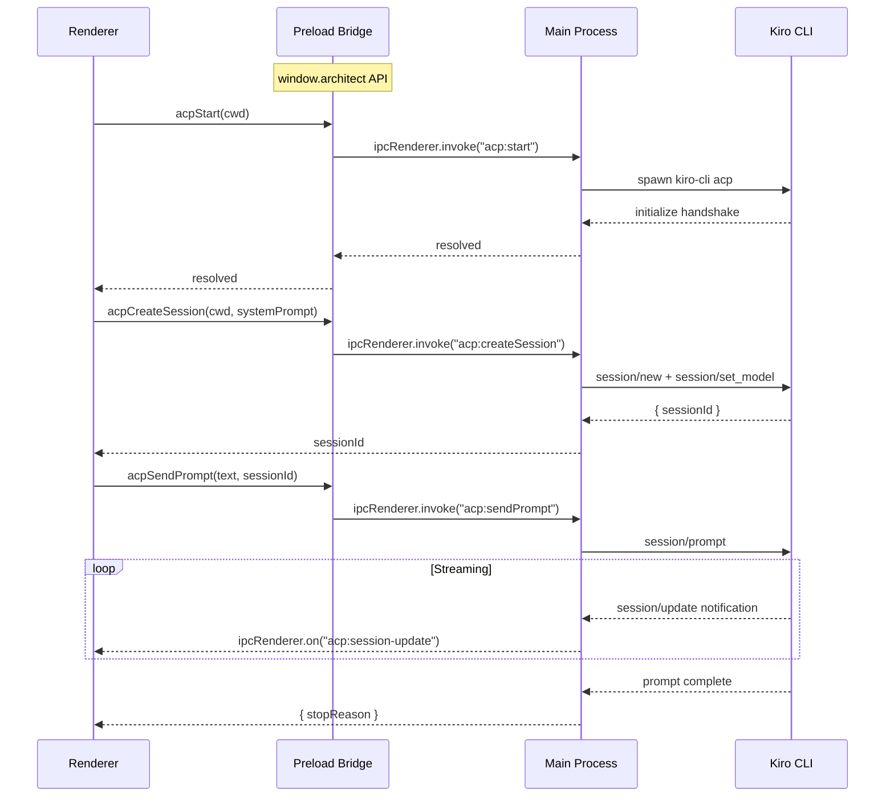

### IPC Channel Map

| Channel | Direction | Purpose |
|---------|-----------|---------|
| `dialog:openFile` | R → M | Open PDF/TXT file picker |
| `dialog:openMarkdown` | R → M | Open markdown file picker |
| `dialog:saveFile` | R → M | Save file dialog |
| `file:readBase64` | R → M | Read file as base64 |
| `file:readText` | R → M | Read file as UTF-8 text |
| `metadata:save` | R → M | Persist policy metadata to disk |
| `metadata:load` | R → M | Load policy metadata from disk |
| `localState:save` | R → M | Persist progressive import state |
| `localState:load` | R → M | Load progressive import state |
| `localState:saveFidelityReport` | R → M | Cache fidelity report to disk |
| `localState:loadFidelityReport` | R → M | Load cached fidelity report |
| `localState:saveScenarios` | R → M | Persist policy scenarios to disk |
| `localState:loadScenarios` | R → M | Load policy scenarios from disk |
| `chatHistory:save` | R → M | Persist chat conversation HTML |
| `chatHistory:load` | R → M | Load chat conversation HTML |
| `aws:getCredentials` | R → M | Get AWS credentials from INI profile |
| `mcp:serverPath` | R → M | Get path to MCP server entry point |
| `approval:getFilePath` | R → M | Get approval code file path |
| `approval:writeCode` | R → M | Write approval code to file |
| `acp:start` | R → M | Spawn Kiro CLI subprocess |
| `acp:createSession` | R → M | Create ACP agent session |
| `acp:sendPrompt` | R → M | Send prompt to agent |
| `acp:cancel` | R → M (fire-and-forget) | Cancel current prompt turn |
| `acp:stop` | R → M (fire-and-forget) | Kill Kiro CLI subprocess |
| `acp:session-update` | M → R | Streamed agent updates (text chunks, tool calls, tool results) |
| `acp:cli-error` | M → R | CLI process-level errors. Payload: `CliErrorEvent { type: 'stderr' \| 'exit', message?: string, code?: number }` |
| `debug:requestExport` | M → R | Menu trigger for debug export (Help → Download Debug Info) |
| `debug:export` | R → M | Export debug info — renderer sends state snapshot, main combines with logs and saves |

---

## Agent Stream Pattern

The `agent-stream.ts` utility encapsulates the save-handler / set-handler / stream / restore-handler pattern used across multiple workflows. It provides two variants:

### `installStreamHandler` (caller-managed lifecycle)

Used when the caller needs to control the send lifecycle (e.g. in-flight prompt tracking, interruption support). Used by `chat-message.ts`.

```
1. Save previous onUpdate handler
2. Install new dispatcher that routes by sessionUpdate type:
   - agent_message_chunk → pushStreamChunk + onMessageChunk
   - tool_call → noteToolCallStarted + noteToolActivity + onToolCall (with logging)
   - tool_result → onToolResult (with error detection)
3. Chain: new handler calls previousHandler?.(update) at the end
4. Return { previousHandler, restore() }
5. Caller calls restore() in finally block
```

### `streamAgentMessage` (fire-and-forget)

Used when the caller just needs to stream a prompt and collect the response. Handles the full lifecycle internally. Used by `policy-loader.ts`, `section-import.ts`, and `chat-session-manager.ts`.

```
1. Calls installStreamHandler internally
2. Calls chatService.sendPolicyMessage(prompt, context)
3. Calls restore() in finally block
```

Both variants accept `StreamCallbacks` (the UI contract) and `StreamOptions` (log prefix).

---

## Chat Message Flow

Shows how a user message travels from the input field through the agent and back to the UI. The `onSendMessage` handler is created by `createSendMessageHandler` in `chat-message.ts` and uses `installStreamHandler` from `agent-stream.ts` for the streaming pattern.

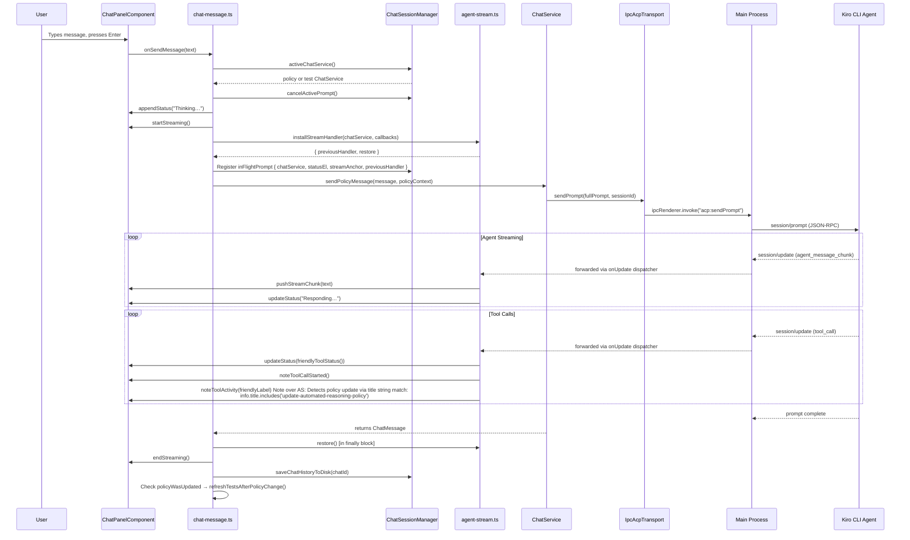

### Prompt Interruption

When the user sends a follow-up message while a prompt is in-flight, `cancelActivePrompt()` at the top of the handler:
1. Checks `chatSessionMgr.inFlightPrompt`
2. Aborts the streaming UI (`abortStreaming`)
3. Restores the previous `onUpdate` handler
4. Rejects the pending ACP request

This allows overlapping messages without corrupted UI state.

---

## Streaming & Card Rendering

The `useStreamProcessor` hook in `src/hooks/useStreamProcessor.ts` processes streamed text incrementally, detecting card boundaries (JSON fenced blocks and XML `<card>` tags) in real time. It produces a `ChatSegment[]` list with stable IDs so React doesn't re-render already-committed segments.

### Known Card Types

| Type | Component | Source File |
|------|-----------|-------------|
| `rule` | `RuleCard` | `cards/RuleCard.tsx` |
| `test` | `TestCard` | `cards/TestCard.tsx` |
| `next-steps` | `PromptActionCard` (variant: `next-step`) | `cards/PromptActionCard.tsx` |
| `follow-up-prompt` | `PromptActionCard` (variant: `suggestion`) | `cards/PromptActionCard.tsx` |
| `variable-proposal` | `VariableProposalCard` | `cards/VariableProposalCard.tsx` |
| `guardrail-validation` | `GuardrailValidationCard` | `cards/GuardrailValidationCard.tsx` |
| `proposal` | `ProposalCard` | `cards/ProposalCard.tsx` |

Card type dispatch is handled by `CardRenderer.tsx`, which switches on `card.type` and renders the appropriate component.

---

## Card Action Dispatch

Cards emit actions via callbacks. The `createCardActionHandler` in `src/workflows/card-actions.ts` routes them. It receives `CardActionDeps` (chatPanel, docPreview, state accessors) via dependency injection from `renderer.ts`.

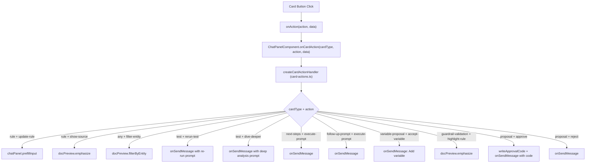

Dismissable card types (`follow-up-prompt`, `next-steps`, `proposal`, `variable-proposal`) trigger sibling dismissal via `chatPanel.dismissBatch` when acted on.

---

## New Policy Creation

Handled by `handleCreatePolicy()` in `renderer.ts`. Creates a policy, parses the markdown document into sections, and shows the progressive import accordion.

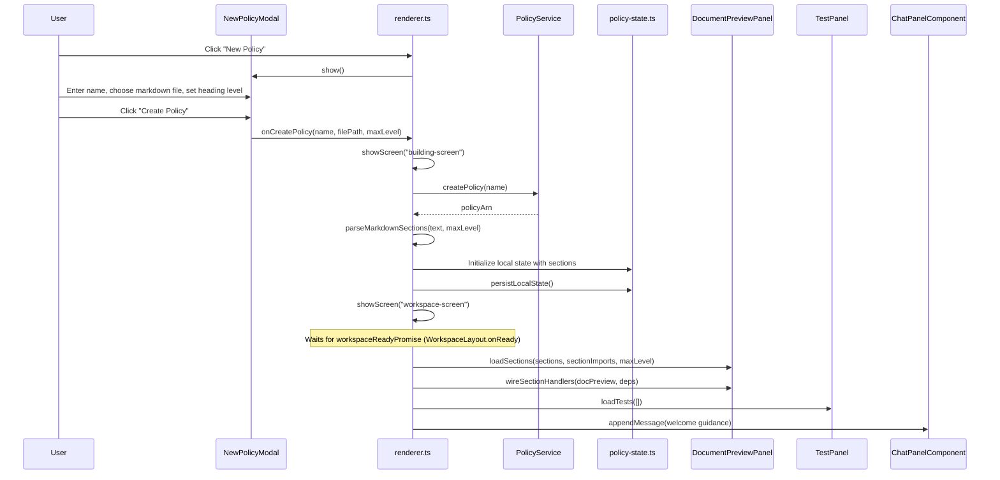

---

## Open Existing Policy

Handled by `loadPolicy()` in `src/workflows/policy-loader.ts`. Receives `PolicyLoaderDeps` from `renderer.ts`.

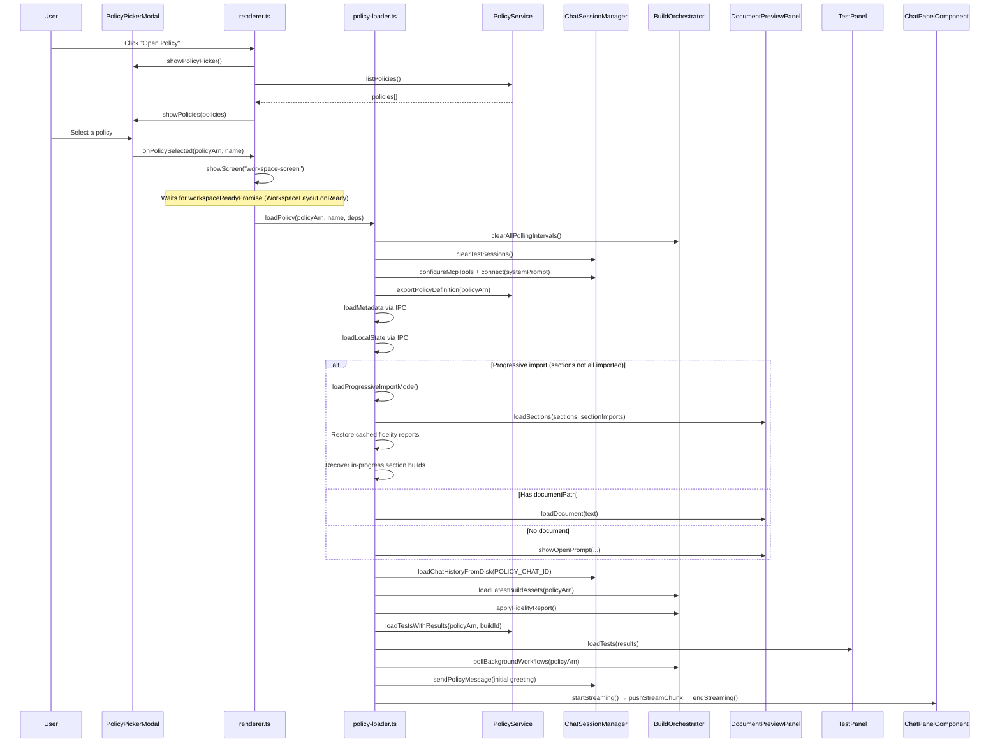

---

## Progressive Section Import

Handled by `importSection()` and `importMultipleSections()` in `src/workflows/section-import.ts`. Receives `SectionImportDeps` from `renderer.ts` via `buildSectionImportDeps()`. Fidelity reports are managed at the whole-policy level by `BuildOrchestrator`, not per-section.

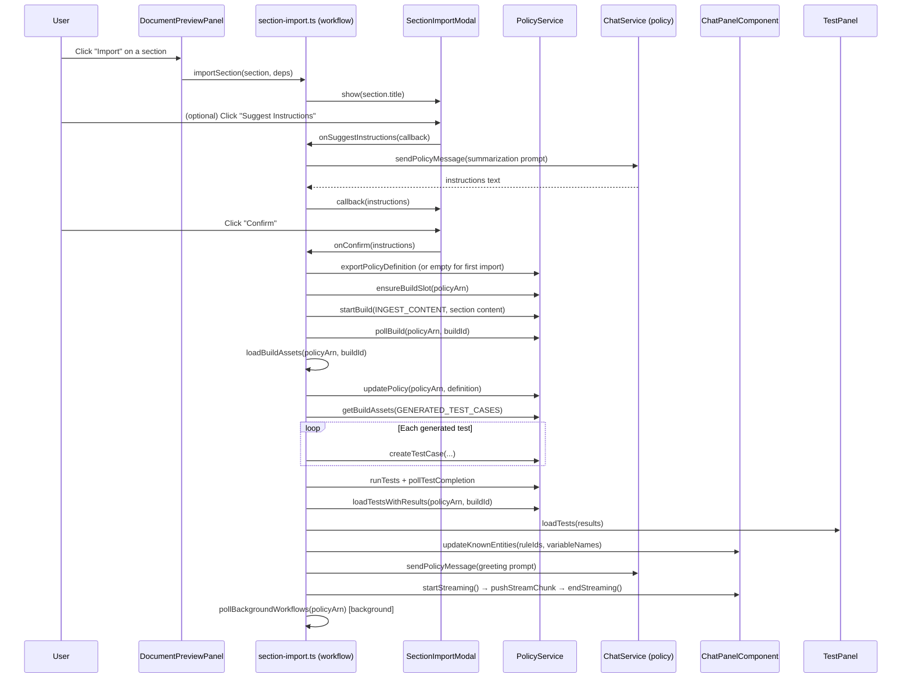

---

## Build Workflow Monitoring

Handled by `BuildOrchestrator.pollBackgroundWorkflows()` in `src/services/build-orchestrator.ts`.

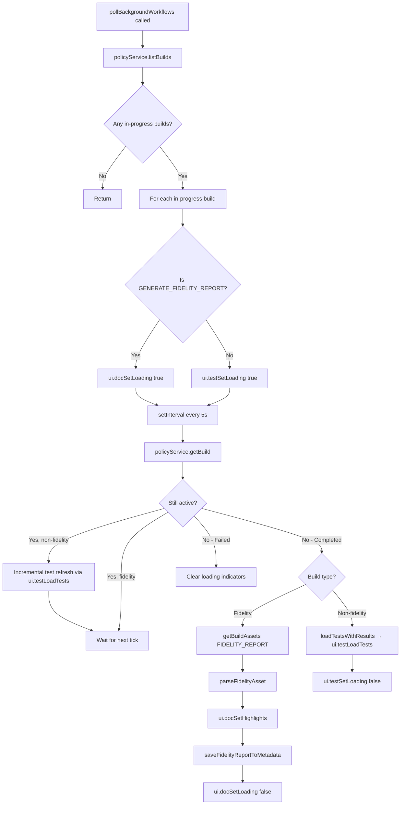

---

## Fidelity Report Flow

Handled by `BuildOrchestrator.applyFidelityReport()` in `src/services/build-orchestrator.ts`.

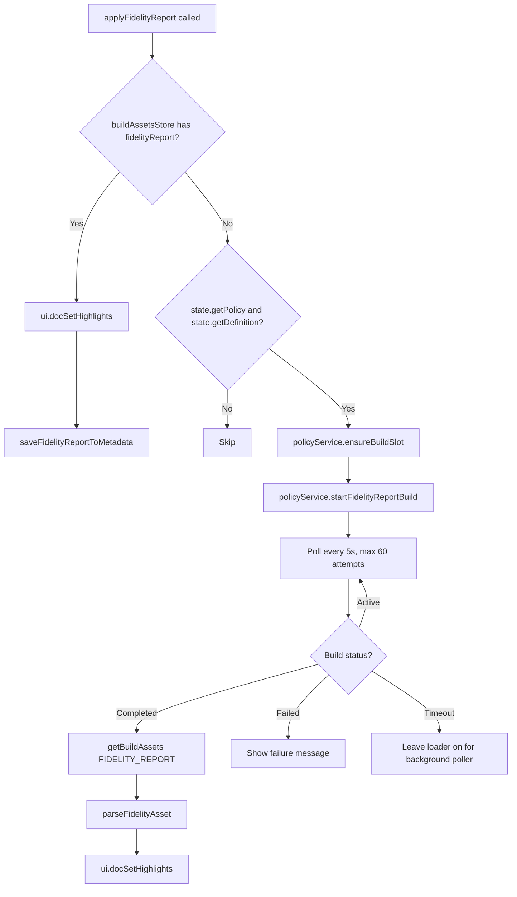

---

## Test Panel Interactions

Test panel event handlers are wired by `wireTestPanelHandlers()` in `src/workflows/test-workflows.ts`. It receives `TestWorkflowDeps` from `renderer.ts`.

```mermaid
flowchart TD
    subgraph "Test Selection (wireTestPanelHandlers)"
        Select[User clicks test item] --> OnSelect[testPanel.onTestSelect]
        OnSelect --> Cancel[chatSessionMgr.cancelActivePrompt]
        Cancel --> SaveSession[Save current session to cache]
        SaveSession --> SetSelected[testPanel.setSelectedTest]
        SetSelected --> SetContext[chatPanel.setContext]
        SetContext --> ApplyFilter[applyTestHighlightFilter → docPreview]
        ApplyFilter --> CheckCache{Session in cache?}
        CheckCache -->|Yes| Restore[Restore cached session + messages]
        CheckCache -->|No disk| NewSession[chatSessionMgr.startTestChatSession]
        CheckCache -->|Disk cache| DiskRestore[Load from disk, create new ChatService]
    end

    subgraph "Test Deselection"
        Deselect[testPanel.onTestDeselect] --> CacheSession[Cache test session]
        CacheSession --> ClearTest[chatSessionMgr.testChatService = null]
        ClearTest --> ClearFilter[docPreview.clearFilter]
        ClearFilter --> RestorePolicy[Restore policy chat from disk]
    end

    subgraph "Back to Policy"
        Back[chatPanel.onBackToPolicy] --> DeselectTest[testPanel.deselectTest]
        DeselectTest --> OnDeselect[onTestDeselect: cancel, cache test, restore policy chat]
    end

    subgraph "Create Test"
        Create[testPanel.onCreateTest] --> API[policyService.createTestCase]
        API --> Refresh[loadTestsWithResults → testPanel.loadTests]
        Refresh --> AutoSelect[Auto-select new test]
    end

    subgraph "Suggest Test"
        Suggest[testPanel.onSuggestTest] --> TempService[Create temporary ChatService]
        TempService --> SendPrompt[Send suggestion prompt]
        SendPrompt --> Parse[Parse JSON response]
        Parse --> Populate[testPanel.populateForm]
    end

    subgraph "Refresh Tests"
        RefreshBtn[testPanel.onRefreshTests] --> FindBuild[policyService.findLatestPolicyBuild]
        FindBuild --> Reload[policyService.loadTestsWithResults]
        Reload --> Update[testPanel.loadTests]
    end
```

---

## Test Chat Session Lifecycle

Managed by `ChatSessionManager` in `src/services/chat-session-manager.ts`. Each test gets its own isolated ChatService session with a test-specific system prompt.

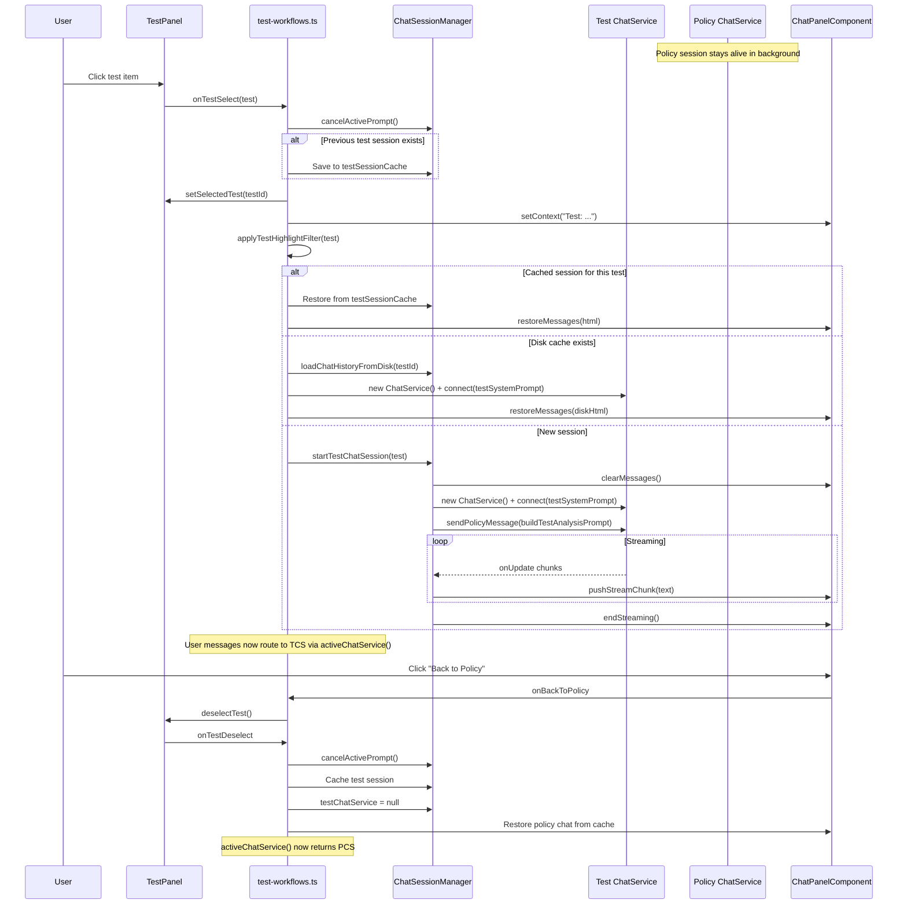

---

## Document Preview Interactions

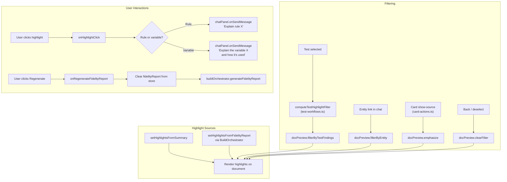

---

## Policy Update Detection

When the agent modifies the policy via REFINE_POLICY, the chat message handler detects it and delegates to `refreshTestsAfterPolicyChange()` in `test-workflows.ts`.

> **Note:** There are two overlapping event paths that trigger test refresh after
> tool execution. The `onAcpUpdate` path catches agent-initiated test runs that
> go through the MCP subprocess (which doesn't flow through the renderer's
> `PolicyService` instance). The `onTestsExecuted` path catches tests run through
> `PolicyService` directly. Consider consolidating into a single event path.

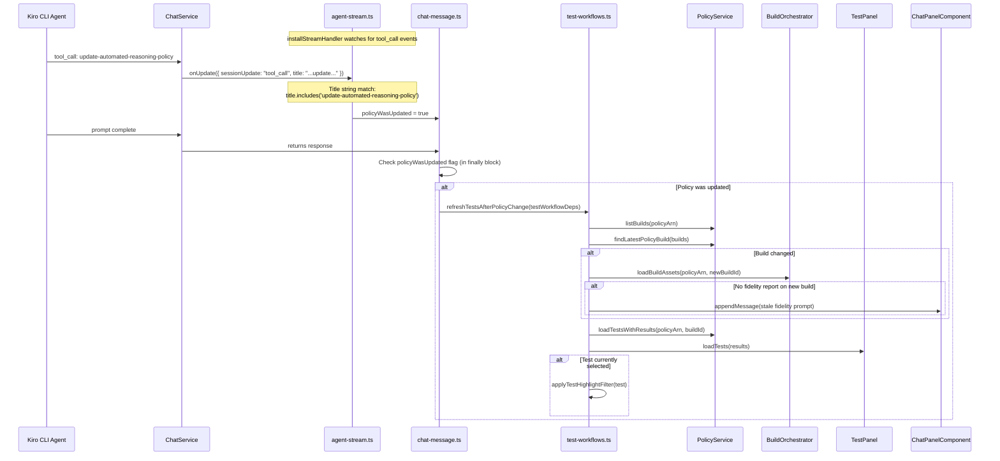

### Additional Test Refresh Triggers (wired in `initializeWorkspaceUI`)

| Trigger | Event Type | Source |
|---------|-----------|--------|
| `policyService.onTestsExecuted()` | Callback | Tests run through renderer's `PolicyService` directly |
| `window.architect.onAcpUpdate` | `tool_call_update` (status: `completed`, title matches `/execute_tests/i`) | Agent-initiated test runs via MCP subprocess |

Both call `refreshTestsAfterPolicyChange()`.

---

## MCP Server Subprocess

The MCP server (`src/mcp-server-entry.ts`) runs as a separate process spawned by the Kiro CLI. It has no access to renderer state or UI callbacks — it owns its own `PolicyService` and `PolicyWorkflowService` instances with independent AWS credentials.

```
Kiro CLI ──stdio──► mcp-server-entry.ts
                      ├── PolicyService (own SDK client)
                      ├── PolicyWorkflowService
                      ├── ContextIndex (loaded from CONTEXT_INDEX_FILE, cached with fs.watch)
                      ├── mcp-request-handler.ts (JSON-RPC routing)
                      └── policy-mcp-server.ts (tool definitions + dispatch)
```

The MCP server and the renderer share two filesystem-based IPC artifacts:

1. **Approval code file** (`APPROVAL_CODE_FILE`): Renderer writes approval codes via `approval:writeCode` IPC → `approval-code-store.writeApprovalCode()`. MCP server consumes codes via `approval-code-store.consumeApprovalCode()` before executing policy-mutating tools.

2. **Context index file** (`CONTEXT_INDEX_FILE`): Renderer serializes the `ContextIndex` to a temp file whenever the index is rebuilt (after policy load, definition changes, fidelity report generation). MCP server loads the file at startup and watches for changes via `fs.watch`, keeping an in-memory cache fresh without polling. The search tools (`search_document`, `search_rules`, etc.) query this cached index.

This means agent tool calls that mutate the policy happen in a different process than the one displaying the UI. The renderer only learns about mutations through the `acp:session-update` / `tool_call_update` event stream forwarded from the Kiro CLI.

---

## Callback Wiring Summary

Components emit events via callbacks. The composition root (`renderer.ts`) wires them to workflows and services. Workflows are wired via `wireTestPanelHandlers()`, `createCardActionHandler()`, and `createSendMessageHandler()`.

| Component | Callback | Wired To | Module |
|-----------|----------|----------|--------|
| `ChatPanelComponent.onSendMessage` | `createSendMessageHandler(deps)` | `chat-message.ts` |
| `ChatPanelComponent.onCardAction` | `createCardActionHandler(deps)` | `card-actions.ts` |
| `ChatPanelComponent.onBackToPolicy` | Delegates to `testPanel.deselectTest()` | `test-workflows.ts` |
| `ChatPanelComponent.onEntityClick` | `docPreview.filterByEntity()` | `renderer.ts` |
| `TestPanel.onTestSelect` | Start/restore test chat session | `test-workflows.ts` |
| `TestPanel.onTestDeselect` | Cache session, clear filter, restore policy | `test-workflows.ts` |
| `TestPanel.onRefreshTests` | `policyService.loadTestsWithResults()` | `test-workflows.ts` |
| `TestPanel.onCreateTest` | `policyService.createTestCase()` + refresh | `test-workflows.ts` |
| `TestPanel.onSuggestTest` | Temporary ChatService for suggestion | `test-workflows.ts` |
| `DocumentPreviewPanel.onHighlightClick` | `chatPanel.onSendMessage("Explain rule/variable X")` | `renderer.ts` |
| `DocumentPreviewPanel.onImportSection` | `importSection(section, deps)` | `section-import.ts` (workflow) |
| `DocumentPreviewPanel.onImportMultipleSections` | `importMultipleSections(sections, deps)` | `section-import.ts` (workflow) |
| `DocumentPreviewPanel.onRegenerateFidelityReport` | `buildOrchestrator.generateFidelityReport()` | `renderer.ts` |
| `DocumentPreviewPanel.onEntityFilterBack` | No-op (filter already cleared) | `renderer.ts` |
| `DocumentPreviewPanel.onGranularityChange` | Re-parse sections, update accordion | `section-wiring.ts` / `renderer.ts` |
| `PolicyPickerModal.onSelect` | `loadPolicy(policyArn, name)` | `policy-loader.ts` |
| `PolicyPickerModal.onDismiss` | `setPickerVisible(false)` | `App.tsx` |
| `NewPolicyModal.onCreate` | Full new policy creation workflow | `renderer.ts` |
| `NewPolicyModal.onDismiss` | `setNewPolicyVisible(false)` | `App.tsx` |
| `policyService.onTestsExecuted` | `refreshTestsAfterPolicyChange()` | `renderer.ts` |
| `window.architect.onAcpUpdate` (global) | Detect `execute_tests` completion → refresh tests | `renderer.ts` |

---

## Debug Logging & Export

The debug logging system captures structured events in the main process and provides a user-facing export via the Help menu. The `DebugLogger` is the only new event consumer — it taps existing ACP event streams without adding new producers.

### Event Consumers

| Event | Existing consumers (unchanged) | New consumer |
|-------|-------------------------------|-------------|
| `session-update` | IPC forward → `logToolFailure` → conditional `logAgentTrace` | `debugLogger.logEvent` (tail position) |
| `stderr` | `console.error` → IPC forward | `debugLogger.logEvent` (tail position) |
| `exit` | `console.log` → IPC forward | `debugLogger.logEvent` (tail position) |

### Debug Export Flow

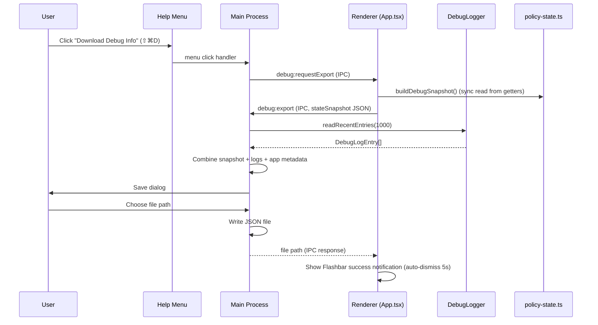

### Log Storage

- Location: `~/.ARchitect/logs/debug.jsonl`
- Format: JSON-lines (one `DebugLogEntry` per line)
- Rotation: 10 MB max per file, 2 rotated files kept (`.1`, `.2`)
- Always active — no env var required (unlike `ARCHITECT_DEBUG` terminal logging)

### Selective IPC Logging

The following IPC handlers log request metadata to the debug log:

| Channel | Logged fields |
|---------|--------------|
| `acp:start` | `cwd` |
| `acp:createSession` | `cwd` |
| `acp:sendPrompt` | `sessionId`, `promptLength` |
